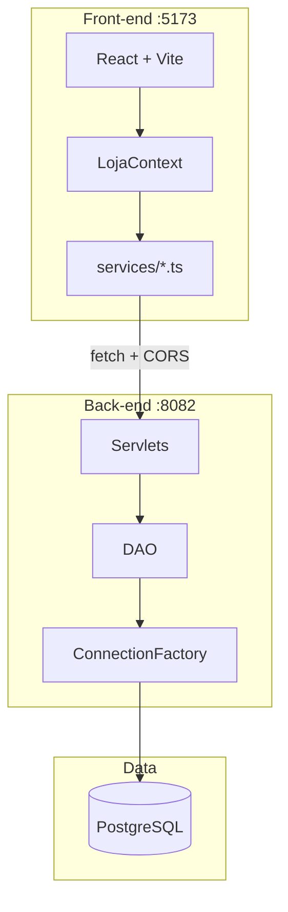

<div align="center">


<br/>

[](https://react.dev/)
[](https://www.typescriptlang.org/)
[](https://openjdk.org/)
[](https://www.postgresql.org/)
[](https://www.docker.com/)
[](https://vitejs.dev/)
[](https://getbootstrap.com/)

<br/>

**Catálogo boutique de móveis de luxo** · Atividade Final · React + Java + PostgreSQL

[](.)
[](.)
[](.)
[](.)

<br/>

[Começar agora](#-quick-start) ·
[Features](#-features) ·
[API](#-api-reference) ·
[Prints](#-preview) ·
[Vídeo](#-vídeo)

<br/>


</div>

<br/>

## 📋 Table of Contents

- [About](#-about)
- [Features](#-features)
- [Preview](#-preview)
- [Quick Start](#-quick-start)
- [Installation](#-installation)
- [Configuration](#-configuration)
- [Tech Stack](#-tech-stack)
- [Architecture](#-architecture)
- [Database](#-database)
- [API Reference](#-api-reference)
- [CORS](#-cors)
- [Project Structure](#-project-structure)
- [Academic Info](#-academic-info)
- [Delivery Checklist](#-delivery-checklist)
- [Video](#-vídeo)
- [Acknowledgments](#-acknowledgments)

<br/>

## 📖 About

> E-commerce editorial para **móveis de alto padrão**. O visitante navega pelo catálogo; o administrador gerencia o acervo com **CRUD completo** — dados no **PostgreSQL**, expostos por **API Java** e consumidos pelo **React** via `fetch`.

| Persona | O que faz |
|:--------|:----------|
| **Visitante** | Home, catálogo, filtros, detalhe, carrinho |
| **Admin** | Criar · listar · editar · excluir produtos + dashboard |
| **Avaliação** | Entidade `Produto` com REST + persistência real |

<br/>

## ✨ Features

| Front-end | Back-end |
|:----------|:---------|
| React 18 + Vite + TypeScript | Java 17 + Servlets |
| Bootstrap responsivo | JDBC + `ConnectionFactory` |
| Interfaces `IProduto` | DAO + Model por domínio |
| Dashboard com contadores | CRUD JSON em `/api/produtos` |
| `fetch` + sessão HTTP | CORS + tratamento de erros |
| Context API (`LojaContext`) | Transação de pedidos + estoque |

**Extras:** autenticação · depoimentos · CMS da home · upload de imagens · logs `[API]` no terminal

<br/>

## 🖼️ Preview

> Adicione suas capturas em [`docs/prints/`](docs/prints/) — nomes sugeridos na tabela.

| # | Tela | Arquivo |
|:-:|------|---------|
| 1 | Listagem + dashboard | `01-listagem-dashboard.png` |
| 2 | Cadastro | `02-cadastro-produto.png` |
| 3 | Edição | `03-edicao-produto.png` |
| 4 | Exclusão | `04-exclusao-lista.png` |
| 5 | Postman GET | `05-postman-get.png` |
| 6 | Postman POST | `06-postman-post.png` |

<br/>

<p align="center">
  
  <br /><sub><b>Catálogo</b> — listagem com dashboard de métricas</sub>
</p>

<p align="center">
  
  <br /><sub><b>CRUD</b> — formulário de cadastro</sub>
</p>

<p align="center">
  
  <br /><sub><b>API</b> — GET /api/produtos no Postman</sub>
</p>

<br/>

## 🚀 Quick Start

```bash
git clone https://github.com/SEU-USUARIO/SEU-REPO.git
cd n1-2
npm start
```

| URL | Endereço |
|-----|----------|
| **Front** | http://localhost:5173 |
| **API** | http://localhost:8082/luar-api |
| **Admin** | `admin@luar.com` / `admin123` |

<br/>

## 📦 Installation

### Prerequisites


| Ferramenta | Versão |
|------------|--------|
| Docker Desktop | latest |
| JDK | 17+ |
| Maven | 3.9+ |
| Node.js | 18+ |

### Steps

```bash
# 1. Clone
git clone https://github.com/SEU-USUARIO/SEU-REPO.git && cd n1-2

# 2. Front dependencies (first time)
npm run install:front

# 3. Environment
bash scripts/ensure-front-env.sh

# 4. API + database (Docker)
npm run stack

# 5. Front dev server
npm run dev
```

<details>
<summary><b>Alternative: one-liner stack only</b></summary>

<br />

```bash
npm run stack    # Postgres + Tomcat + mvn package
npm run dev      # Vite
npm run logs:api # watch [API] request logs
```

```bash
docker compose down              # stop
docker compose down -v && npm run stack   # reset DB
```

</details>

<br/>

## ⚙️ Configuration

Crie `apps/web/.env.local` (ou use `scripts/ensure-front-env.sh`):

```env
VITE_API_BASE_URL=http://localhost:8082/luar-api
```

| Variável (Tomcat / Docker) | Padrão |
|----------------------------|--------|
| `JDBC_URL` | `jdbc:postgresql://db-java:5432/luar_java` |
| `JDBC_USER` / `JDBC_PASSWORD` | `postgres` / `postgres` |
| Postgres (host) | `localhost:5434` |

<br/>

## 🛠 Tech Stack

<div align="center">


</div>

<br/>

| Layer | Stack | Path |
|:-----:|:------|:-----|
| **UI** | React · TypeScript · Bootstrap · Framer Motion | `apps/web/` |
| **API** | Jakarta Servlets · Gson · JDBC | `apps/api/` |
| **DB** | PostgreSQL 16 | `database/java/` |
| **Ops** | Docker Compose · Tomcat 10 | `docker-compose.yml` |

> Academic requirement: **Option B** — Servlets + JDBC (no Hibernate).

<br/>

## 🏗 Architecture



<details>
<summary><b>Layer responsibilities</b></summary>

<br />

| Path | Role |
|------|------|
| `apps/web/src/pages/` | Route pages |
| `apps/web/src/components/` | Reusable UI |
| `apps/web/src/store/LojaContext.tsx` | Global state |
| `apps/web/src/services/` | HTTP clients |
| `apps/api/.../model/` | Entities (`Produto`, …) |
| `apps/api/.../dao/` | SQL access |
| `apps/api/.../web/` | REST servlets + `CorsFilter` |
| `apps/api/.../infra/` | JDBC factory |

</details>

<br/>

## 🗄 Database

**Script:** [`database/java/schema_java_standalone.sql`](database/java/schema_java_standalone.sql)

### Table `produtos` (graded entity)

| Column | Type | Description |
|:-------|:-----|:------------|
| `id` | `SERIAL` | Primary key |
| `nome` | `VARCHAR(255)` | Product name |
| `categoria` | `VARCHAR(150)` | Room / category |
| `preco` | `NUMERIC(10,2)` | Price |
| `estoque` | `INTEGER` | Stock |
| `descricao_curta` / `descricao_longa` | text | Descriptions |
| `imagem` | `VARCHAR(500)` | Image URL |
| `destaque_carrossel` | `BOOLEAN` | Home carousel |

```bash
# Auto (Docker init)
npm run stack

# Manual
psql -h localhost -p 5434 -U postgres -d luar_java \
  -f database/java/schema_java_standalone.sql
```

<br/>

## 🔌 API Reference

**Base URL** → `http://localhost:8082/luar-api`

### Products (CRUD)

| | Method | Endpoint | Auth |
|:-:|--------|----------|:----:|
| 📄 | `GET` | `/api/produtos` | public |
| 📄 | `GET` | `/api/produtos/{id}` | public |
| ➕ | `POST` | `/api/produtos` | admin |
| ✏️ | `PUT` | `/api/produtos/{id}` | admin |
| 🗑️ | `DELETE` | `/api/produtos/{id}` | admin |

<details>
<summary><b>Request body (POST / PUT)</b></summary>

```json
{
  "nome": "Sofá Aurora",
  "categoria": "Sala",
  "descricaoCurta": "Linhas baixas, abraço amplo.",
  "descricaoLonga": "Peça de curadoria para estar prolongado.",
  "preco": 12990.0,
  "estoque": 5,
  "imagem": "",
  "destaqueCarrossel": true
}
```

</details>

### Postman flow

1. `POST /api/auth/login` → `{"email":"admin@luar.com","senha":"admin123"}`
2. Save cookie **`JSESSIONID`**
3. Call `POST` / `PUT` / `DELETE` on `/api/produtos`

### cURL

```bash
curl -s http://localhost:8082/luar-api/api/produtos

curl -c cookies.txt -X POST http://localhost:8082/luar-api/api/auth/login \
  -H "Content-Type: application/json" \
  -d '{"email":"admin@luar.com","senha":"admin123"}'

curl -b cookies.txt -X POST http://localhost:8082/luar-api/api/produtos \
  -H "Content-Type: application/json" \
  -d '{"nome":"Mesa API","categoria":"Jantar","descricaoCurta":"x","descricaoLonga":"x","preco":1999,"estoque":2,"imagem":"","destaqueCarrossel":false}'
```

📚 Full API docs → [`apps/api/README.md`](apps/api/README.md)

<br/>

## 🌐 CORS

| Origin | Port |
|--------|------|
| Vite | `http://localhost:5173` |
| Tomcat | `http://localhost:8082` |

Cross-origin → browser blocks without headers. Implemented in [`CorsFilter.java`](apps/api/src/main/java/com/luarmoveis/web/CorsFilter.java):

- `Access-Control-Allow-Origin` (echoes React origin)
- `Access-Control-Allow-Credentials` (session cookie)
- Methods: `GET, POST, PUT, DELETE, OPTIONS`

<br/>

## 📁 Project Structure

```
n1-2/
├── 📂 apps/
│   ├── 🌐 web/              # React + Vite + TypeScript
│   └── ☕ api/              # Java WAR (luar-api)
├── 📂 database/java/        # PostgreSQL schema
├── 📂 docs/
│   ├── ROTEIRO-VIDEO.md
│   └── prints/
├── 📂 scripts/              # stack-up · ensure-env · logs
├── 🐳 docker-compose.yml
├── 🚀 run.sh
└── 📄 README.md
```

<br/>

## 🎓 Academic Info

| | |
|---|---|
| **Students** | João Pedro *(add teammates)* |
| **Course** | Desenvolvimento Web |
| **Professor** | Fernando |
| **Date** | Maio de 2026 |
| **Theme** | Product catalog — luxury furniture |

Site footer also shows: developer name · course · professor · date.

<br/>

## ✅ Delivery Checklist

- [x] React + TypeScript + Bootstrap + responsive layout
- [x] List · create · edit · delete + UI refresh
- [x] Dashboard / counters
- [x] Data from Java API (not hardcoded arrays)
- [x] Servlets + JDBC + `ConnectionFactory`
- [x] PostgreSQL + SQL script
- [x] CORS configured
- [x] README + `.gitignore` + commits
- [ ] Video link (3–5 min) — [add below](#-vídeo)
- [ ] Screenshots in `docs/prints/`

<br/>

## 🎥 Vídeo

| | |
|---|---|
| **Link** | **[ INSERT YOUTUBE / DRIVE URL ]** |
| **Script** | [`docs/ROTEIRO-VIDEO.md`](docs/ROTEIRO-VIDEO.md) |

Topics: theme · CRUD demo · React↔Java · CORS · Postman

<br/>

## 🙏 Acknowledgments

- Activity 06 extended to full-stack integration
- Design reference: `design-system/luar-moveis/`
- [Awesome README](https://github.com/matiassingers/awesome-readme) patterns

<br/>

---

<div align="center">

**Luar Móveis**

*Desenvolvimento Web · Prof. Fernando · 2026*

<br/>


<br/>

⭐ If this repo helped your studies, consider leaving a star

</div>
